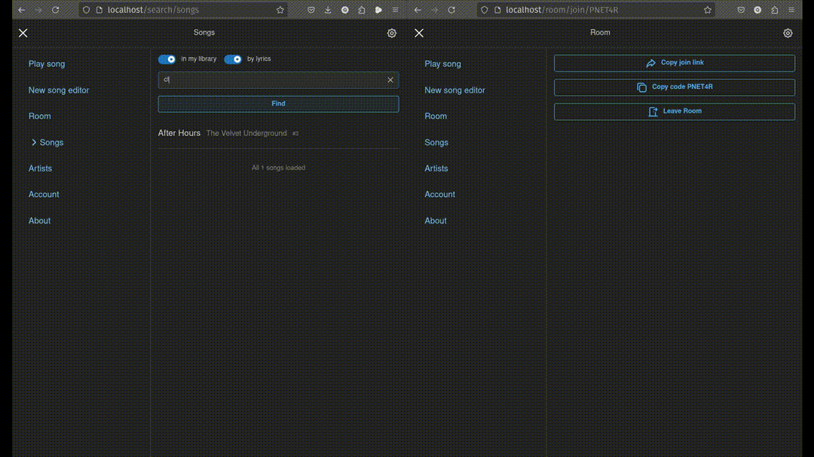
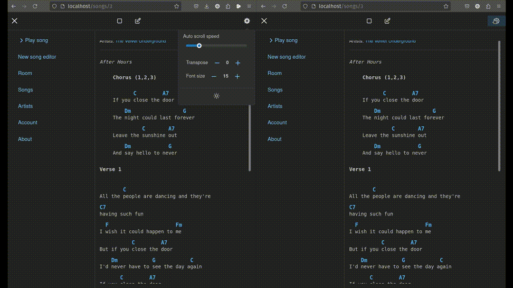

# Chords
This is my pet project that should allow me to keep all my favorite songs with chords and lyrics in one place and play them with my friends on phone or any other device.

*I kept in mind that I would be referencing this project when applying for a new job. And ironically this project is 80% frontend while I'm a backend developer ;)*

#### Enter room

#### Pick song

#### View song

#### Paste Song
Example for Ultimate Guitar  
You can see that I have to edit sheet a little for correct display  

## Motivation
* I wanted to start a pet project I really care about
* I don't like how Ultimate Guitar app works, it is slow, has ads, and limits me to only a subset of songs
* AmDm.ru has flooded itself with ads and is not usable anymore
* other websites have their own limitations, like not allowing to search by lyrics, or not having a mobile-friendly interface
* and (important) I wanted to make sharing songs with friends easy, so they can play along with me

## Features and current state
* Create and edit song with chords and lyrics [Works]
* Search by title or lyrics (full text search) [Works]
* View songs with chords and lyrics [Works]
* Autoscroll with adjustable speed [Works]
* Font size adjustable [Works]
* Chord diagrams [Works most of the time, but a bit tricky]
* Room - sync screen position between members [Works]

## Plans
There are some weak spots I have to address:
* Sometimes it is troublesome to paste songs from the web. It works more or less for Ultimate Guitar where you can copy raw text with chords over words, but usually I have to edit the tabs and sequences of chords manually so they are displayed correctly
* Parser sometimes retrieves chords missing in the diagram database
* Would be nice to have ChordPro syntax support in the editor

The day this app is good enough for me, development will be put on hold.

## Contributing
If you have ideas or want to contribute, feel free to open an issue or a pull request. No guarantees though, I am not sure how much time I will be able to spend on this project.

## Thanks
For [sheet parser](https://github.com/martijnversluis/ChordSheetJS)  
For [chord diagrams](https://github.com/techies23/react-chords)  
For [chords database](https://github.com/tombatossals/react-chords)